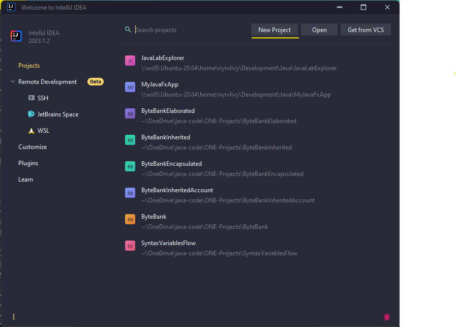
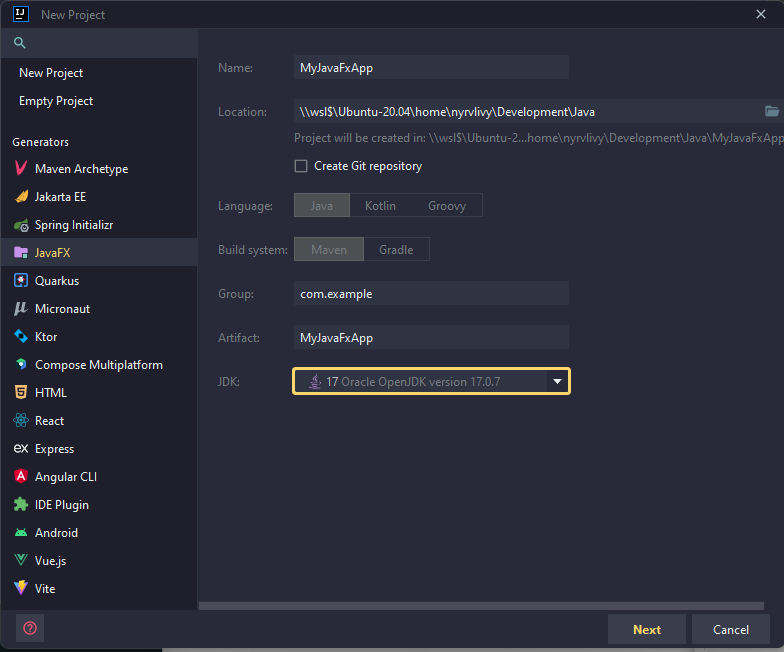
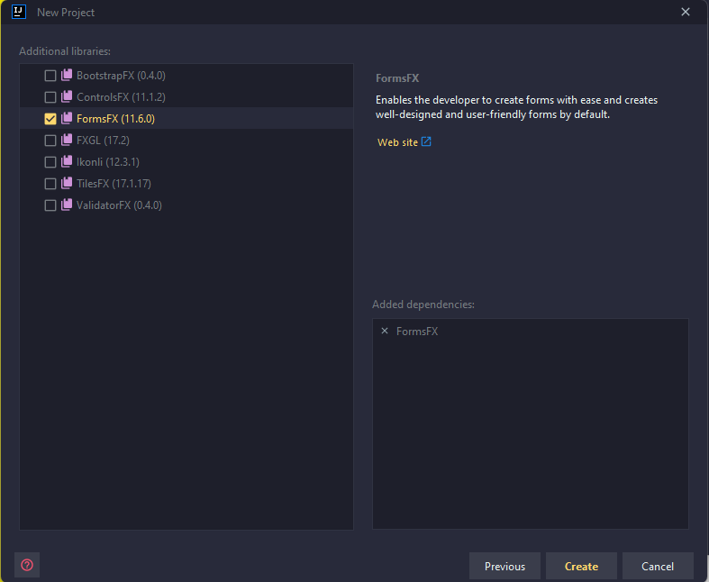
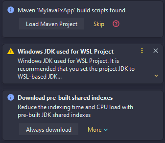
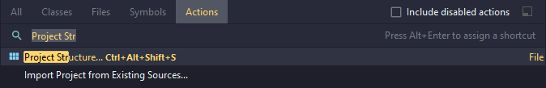
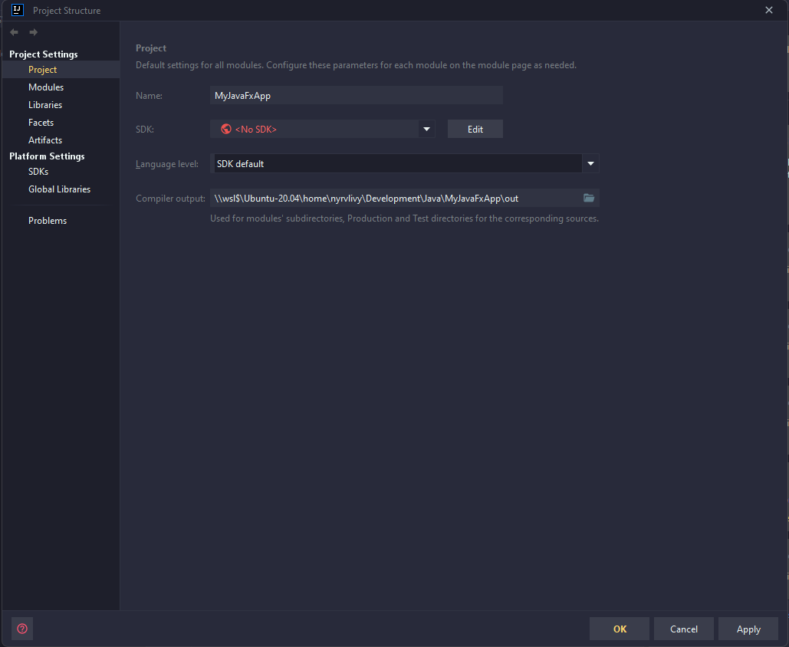
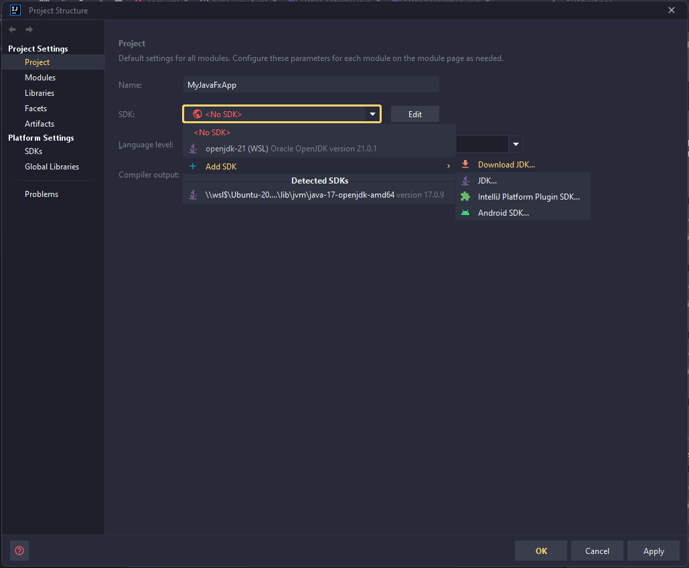
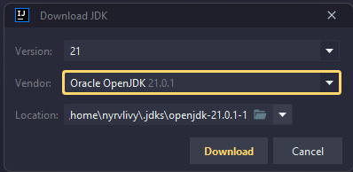
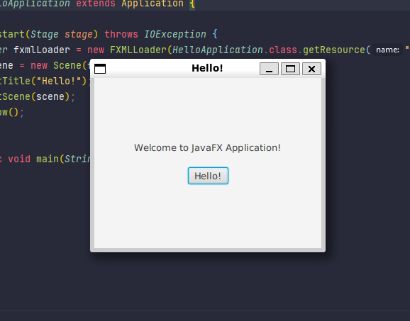

# Configuring JavaFX 21.0.1 (LTS) on IntelliJ with WSL
This is a brief tutorial on how to install JavaFX within your development environment using WSL and configure it on IntelliJ.

---
## 1. Install Java

Check if Java is installed on your Linux, mine is Ubuntu 20.04 (LTS):

```zsh
java --version
```
*Output:*

```zsh
openjdk 17.0.9 2023-10-17
OpenJDK Runtime Environment (build 17.0.9+9-Ubuntu-120.04)
OpenJDK 64-Bit Server VM (build 17.0.9+9-Ubuntu-120.04, mixed mode, sharing)
```

If not installed, run:

```zsh
sudo apt update
sudo apt install -y openjdk-17-jdk
```

Usually located in:

```zsh
/usr/lib/jvm/java-17-openjdk-amd64
```
---
## 2. Install JavaFX and Scene Builder:
- Installation Documentation: [JavaFX Installation](https://openjfx.io/openjfx-docs/#install-javafx)
- JavaFX 21.0.1(LTS) Documentation: [JavaFX 21.0.1(LTS) Documentation](https://openjfx.io/javadoc/21/)

---
### 2.1 JavaFX
---
1. *Create a directory* for better management and organization. 

Note: *You can create it inside the Java folder or a preferred location.*

In this case, let's create a folder named javafx or jfx:

```zsh
cd /usr/lib
sudo mkdir javafx
```

2. *Change permissions* if needed:

```zsh
sudo chmod -R 755 /usr/lib/javafx
```
---
3. Download JavaFX 21.0.1 (LTS) x64 SDK and jmods from [OpenJFX](https://openjfx.io/).

Note: *Install it anywhere to avoid permission conflicts, e.g., in the home directory.*

4. Unzip the files, keeping only the folders:

```zsh
~/javafx-sdk-21.0.1
~/javafx-jmods-21.0.1
```

5. Create a `jmods folder` inside `javafx-sdk-21.0.1`:

```zsh
mkdir ~/javafx-sdk-21.0.1/jmods
```

6. Transfer all content from `~/javafx-jmods-21.0.1` to `~/javafx-sdk-21.0.1/jmods`:

```zsh
mv ~/javafx-jmods-21.0.1/* ~/javafx-sdk-21.0.1/jmods/
```

Verify:

```zsh
ls ~/javafx-sdk-21.0.1/jmods/
```

7. Move it to the created `javafx folder`:

```zsh
sudo mv ~/javafx-sdk-21.0.1 /usr/lib/javafx/
```

---
### 2.2 Scene Builder
---
Access [Gluon](https://gluonhq.com/products/scene-builder/) and install *Scene Builder* on your Windows system for graphical interface usage.

---

### 2.3 Update .zshrc:
---
Add paths:

```zsh
# Java
export JAVA_HOME=/usr/lib/jvm/java-17-openjdk-amd64
export PATH=$PATH:$JAVA_HOME/bin

# JavaFX
export JAVA_FX_HOME=/usr/lib/javafx/javafx-sdk-21.0.1
export PATH_TO_FX=$JAVA_FX_HOME/lib

# JavaFX (jmods)
export MODULE_PATH=$JAVA_FX_HOME/jmods
```

Check:

```zsh
echo $PATH
echo $JAVA_FX_HOME
echo $PATH_TO_FX
echo $MODULE_PATH
```
--- 

## 3. Configuring IntelliJ

1. Create a new project in the IDE:



2. Choose a JavaFX Generator, name the project, and select the desired JDK (e.g., version 17LTS).



3. Select the FormsFX library:



4. The project will be created, and notifications will appear in the bottom right:



Install build scripts with Maven by clicking "Load Maven Project" in the notifications.

5. Access Project Structure `Ctrl + Shift + Alt+ A` and set the SDK to version 21.0.1.



Note: *Or searching using the shortcut `Ctrl + Shift + A`*

6. Set the SDK to version 21.0.1.:



Note: *Already shown in the picture as the process has been done before*.

Select 'Download JDK':



And download:



8. Now, run the project:

```
Ctrl + Shift + F10
```



---
### Tips:

If you encounter a plugin problem:

Access: [Unresolved Plugin](https://stackoverflow.com/questions/38957963/unresolved-plugin-org-apache-maven-pluginsmaven-jar-plugin2-4) | |
[MVN Repository](https://mvnrepository.com/)

---